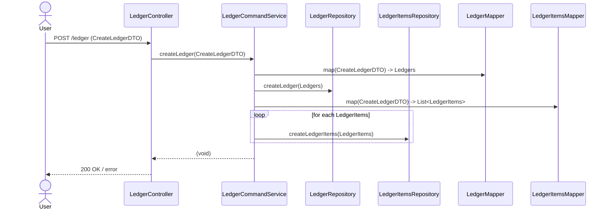
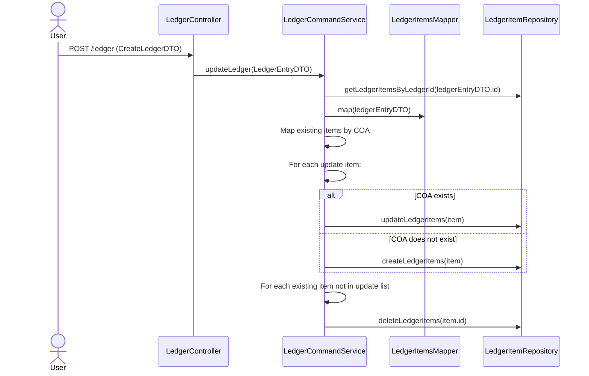
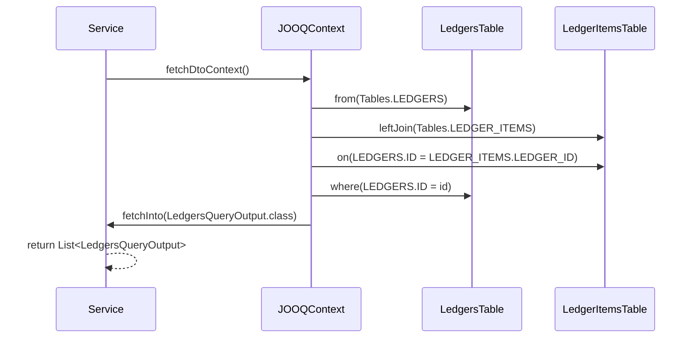
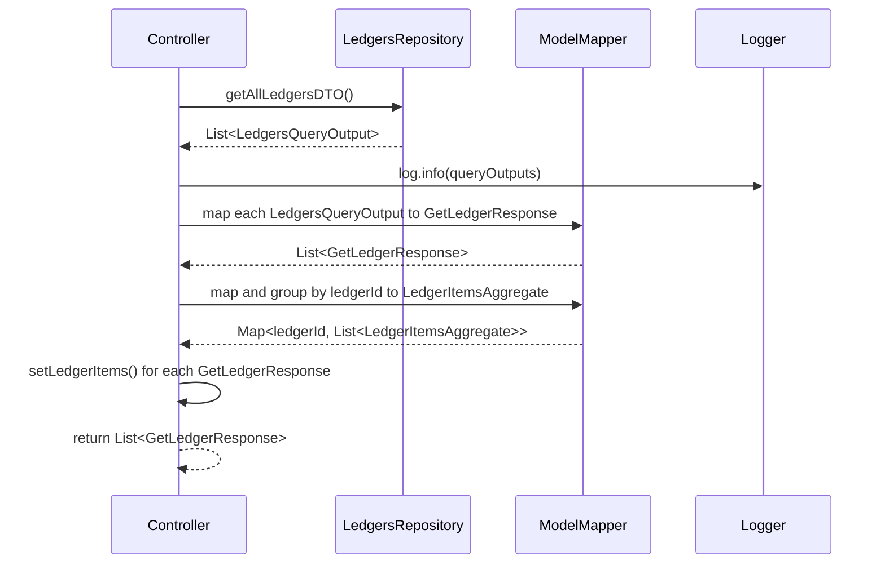
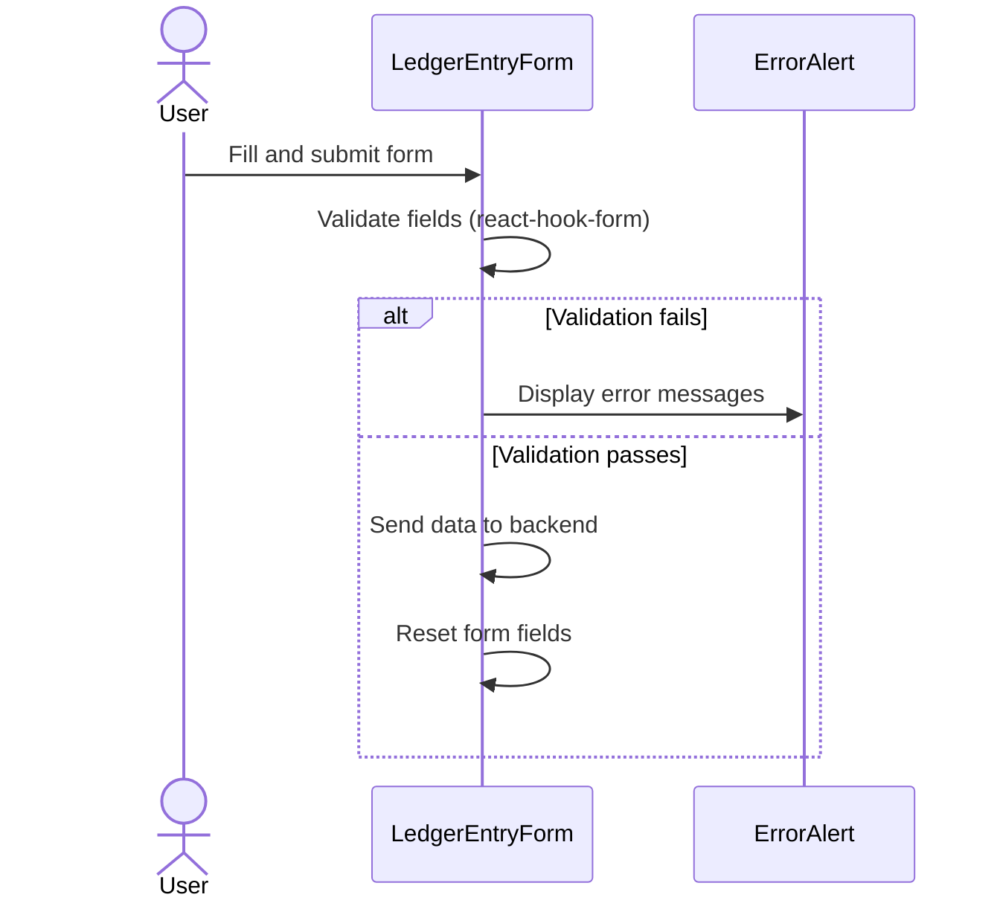

# SpringBoot_CQRS

## Table of Content
1. [install and run process](#install-and-run-process)
2. [highlight function](#highlight-functionality)
3. [development principle](#development-principle)
4. [system design](#system-design)
5. [new technologies used](#new-technology-used-trial--error)
6. [new knowedge gained](#new-knowledge-gained-during-team-meeting--feedback)

## Install and Run Process
```bash
#1 Prepare directory and clone from github
git clone --recurse-submodules -j3 https://github.com/Thee5176/SpringBoot_CQRS
cd SpringBoot_CQRS

#2 make migration, build process

##2.1 Command Unit: spin up postgres container and set up DB
docker compose up postgres -d --build
cd springboot_cqrs_command
chmod +x mvnw
./mvnw flyway:migrate
./mvnw clean package -DskipTests
cd ..

##2.2 Query Unit:
cd springboot_cqrs_query
chmod +x mvnw
./mvnw clean package -DskipTests
cd ..

#3 Start All Service
docker compose build --no-cache
docker compose up -d
```
# Highlight Functionality

## Springboot Command Service

| Feature                      | Description                                                                                                                                                                               | Reference Link                                                                                                                                                         |
|-----------------------------|-------------------------------------------------------------------------------------------------------------------------------------------------------------------------------------------|----------------------------------------------------------------------------------------------------------------------------------------------------------------------|
| Custom Object Mapper         | Configure ModelMapper Beans to customize field mapping between DTO and two Domain Entities                                                                                                | [ModelMapperConfig.java](https://github.com/Thee5176/SpringBoot_CQRS_Command/blob/develop/src/main/java/com/thee5176/ledger_command/Application/config/ModelMapperConfig.java) |
| Double Input Validation Logic| - **BalanceCheck**: Validate if sum of "amount" per "balanceType" matches (via custom validation class comparing with BigDecimal.ZERO)<br>- **Unique "Code of Account" Check**: Ensure no duplicates in LedgerItems list using DTO method + Hibernate UniqueElements | - [BalanceCheckValidator.java](https://github.com/Thee5176/SpringBoot_CQRS_Command/blob/develop/src/main/java/com/thee5176/ledger_command/Application/validation/BalanceCheckValidator.java)<br>- [LedgersEntryDTO.java - unique COA](https://github.com/Thee5176/SpringBoot_CQRS_Command/blob/develop/src/main/java/com/thee5176/ledger_command/Application/dto/LedgersEntryDTO.java#L37) |
| Transaction Management      | - **Create Transaction**: Manage create entity transaction incl. aggregated entities<br>- **Replacement Update Transaction**: Upsert logic via Java Stream for update/create/delete steps | - [Create Transaction](https://github.com/Thee5176/SpringBoot_CQRS_Command/blob/develop/src/main/java/com/thee5176/ledger_command/Domain/service/LedgerCommandService.java#L33)<br>- [Update Transaction](https://github.com/Thee5176/SpringBoot_CQRS_Command/blob/develop/src/main/java/com/thee5176/ledger_command/Domain/service/LedgerCommandService.java#L56) |

### Sequence Diagrams for Transaction Management

**Create Transaction**


**Replacement Update Transaction**

---

## Springboot Query Service

| Feature                     | Description                                                                                                    | Reference Link                                                                                                                               |
|-----------------------------|----------------------------------------------------------------------------------------------------------------|---------------------------------------------------------------------------------------------------------------------------------------------|
| Join Table Query with JOOQ  | Tackle N+1 Problem in Repository Layer using JOIN query                                                       | [LedgersRepository.java](https://github.com/Thee5176/springboot_cqrs_query/blob/develop/src/main/java/com/thee5176/ledger_query/Infrastructure/repository/LedgersRepository.java#L57) |
| Flatten Data Extraction     | Tackle N+1 Problem in Service Layer by creating Map of Id to Entity (removes recursive querying)               | [LedgersQueryService.java](https://github.com/Thee5176/SpringBoot_CQRS_Query/blob/develop/src/main/java/com/thee5176/ledger_query/Domain/service/LedgersQueryService.java#L24)       |

### Join Table Query with JOOQ - Sequence Diagram


### Flatten Data Extraction Transaction - Sequence Diagram



---

## Frontend React Form

| Feature                     | Description                                                                                                  | Reference Link                                                                                                                     |
|----------------------------|--------------------------------------------------------------------------------------------------------------|-----------------------------------------------------------------------------------------------------------------------------------|
| Dynamic Component Combination | Use Atomic Design Pattern to break down complex components into simpler, maintainable ones                        |                                   |
| Dynamically Add LedgerItems | Dynamically add new LedgerItems input fields                                                                 | - [LedgerItemInputField.tsx](https://github.com/Thee5176/React_MUI_Accounting_CQRS/blob/develop/src/components/LedgerItemInputField/index.tsx)<br>- [LedgerItemsFormTable.tsx](https://github.com/Thee5176/React_MUI_Accounting_CQRS/blob/99129f8f92ce6f16994f2c5bc34de9fb2cbabeb6/src/components/LedgerItemsFormTable.tsx)<br> |
| Fetch COA Select Field      | Fetch "Code of Account" select options from Query Service                                                    | [CoaField.tsx](https://github.com/Thee5176/React_MUI_Accounting_CQRS/blob/develop/src/components/LedgerItemInputField/CoaField.tsx) <br> |
| React Hook Form Integration | Manage form submit function using React Hook Form's useForm hook                                            | [LedgerEntryForm.tsx](https://github.com/Thee5176/React_MUI_Accounting_CQRS/blob/develop/src/pages/LedgerEntryForm.tsx)<br>- [Confluence Report](https://thee5176.atlassian.net/wiki/spaces/~7120207a78457b1be14d1eb093ee37135d9fb6/pages/68026372/React+MUI#3.-Form-handling-with-React-Hook-Form) |
| Validation & Error Message  | Validate input fields and display error messages before submission                                            | [Validation Example](https://github.com/Thee5176/React_MUI_Accounting_CQRS/blob/develop/src/pages/LedgerEntryForm.tsx)  |
| Reusable Validation Component | Centralize validation error message display                                                                | [Error Message Component](https://github.com/Thee5176/React_MUI_Accounting_CQRS/blob/develop/src/components/ErrorAlert.tsx) <br> |

### Validation Condition and Error Message - Sequence Diagram


---

# Development Principle

| Branch Type | Branch From | Usage                                 | When to Merge Back                                   | Notes                         |
|-------------|-------------|-------------------------------------|-----------------------------------------------------|-------------------------------|
| main        | —           | For deploying new features           | Only merge back when codebase is confirmed & ready | Deployment branch              |
| develop     | main        | Manage development of multiple features| Only merge back when codebase is confirmed & ready | Integration branch            |
| feature     | develop     | Local development & atomic commits   | No restrictions; multiple feature branches allowed | Parallel feature development  |
| hotfix      | main        | Bug fixes                           | Merge back once bug is fixed                         | Multiple hotfix branches allowed |

**Additional Notes:**

- Follow a Top-Down Software Development Approach:  
  DB Design → Module Design → Implementation
- Use Git best practices as per "[A successful Git branching model](https://nvie.com/posts/a-successful-git-branching-model/)"
- Manage parallel branches with clear merge strategy for stability

---

If you want, I can also provide this as a markdown file content ready to save locally.


## System Design

### Frontend: Quick Handdraw UI Design（Wireframe + Component Planning）
- Wireframe Design  
  

- Component Planning  
  


### Backend: DB and Module Design
- Version 1:
    - DB Design:
        - Table that save values of Accounting Transaction as "Transaction" Table
        - Table that save values of Accounting Entries(Transaction by each Code of Account) as "Entries" Table
    - Module Design:
        - Command and Query Service hosted separately from each other.
        - Separate DB module to take advantage of both SQL (reliable write: predefined schema and ACID properties) and NoSQL(faster read: simple query and BASE properties) database.
        - CQRS Pattern with Kafka Message Service and Eventual Consistency Service between 2 Database
        - Repository library: 
            - JOOQ on the Command side for thorough　customizable ORM mapping.
      
- Version 2:
    - DB Design:
        - Change "Transaction" Table to "Ledgers"
        - Chagne "Entry" Table to "LederItems"
    - Module Design:
        - Combine Database and use only SQL Database (Comment from meeting: separate DB module is too redundant to user scale)
        - Remove Message Service and Eventual Consistency Service as for the usage of one DB
        - Repository library:
            -  Both use the same JOOQ for development process consistency.
      


## New Technology Used (Trial & Error)
- Git Flow, Git Pull Request, Git Issues and Git Submodule
    - manage local branch according to best practice branching strategy [GitFlow]
    - review change before merge branch with Git Pull Request [Git Pull Request](https://github.com/pulls?q=is%3Apr+author%3AThee5176+archived%3Afalse+repository%3Bspringboot*)
    - Manage aggregate project that separate each git history [Git Submodule](https://github.com/Thee5176/SpringBoot_CQRS/tree/main)
    - Reference: [Git実践入門](https://gihyo.jp/book/2014/978-4-7741-6366-6)

- Github Workflow
    - set up continuous integration for verify building process
    - [Command Unit Workflow](https://github.com/Thee5176/springboot_cqrs_command/actions/workflows/testrun.yaml)
    - [Query Unit Build Workflow](https://github.com/Thee5176/springboot_cqrs_query/actions/workflows/testrun.yaml)
    - [Deployment Workflow](https://github.com/Thee5176/SpringBoot_CQRS/actions/workflows/testrun.yaml)

- Sourcery.ai - Pull Request Review Service
    - AI-generated change review guideline
    - create code suggestion [Example PR Review Message](https://github.com/Thee5176/springboot_cqrs_command/pull/9#issuecomment-3092684740)
    - source: [Sourcery AI](https://sourcery.ai/)

- Flyway 
    - set up Flyway database migration service in [pom.xml](https://github.com/Thee5176/springboot_cqrs_command/blob/develop/pom.xml#L162)
    - manage database version [source/main/resources/db/migrations](https://github.com/Thee5176/springboot_cqrs_command/tree/develop/src/main/resources/db/migration)
    - source: [Spring Doc](https://docs.spring.io/spring-boot/how-to/data-initialization.html#howto.data-initialization.migration-tool.flyway)

- JOOQ
    - Top-Down Development process with JOOQ Codegen
        - Design the Database with dbml language [DB Design Document](https://dbdocs.io/theerapong5176/Springboot_CQRS?view=relationships)
        - Generate DDL script from [dbdiagram.io](https://dbdiagram.io/)
        - Setup JOOQ Codegen dependency with [pom.xml](https://github.com/Thee5176/springboot_cqrs_command/blob/develop/pom.xml#L175)
        - source: [JOOQ Document](https://www.jooq.org/doc/latest/manual/code-generation/codegen-execution/codegen-maven/)

- ModelMapper
    - set up ModelMapper in [pom.xml](https://github.com/Thee5176/springboot_cqrs_command/blob/develop/pom.xml#L78)
    - config custom DTO [ModelMapperConfig](https://github.com/Thee5176/springboot_cqrs_command/blob/develop/src/main/java/com/thee5176/ledger_command/Application/config/ModelMapperConfig.java)
    - source: [ModelMapper Document](https://modelmapper.org/getting-started/)
 
- Arrange-Act-Assert Testing Process:
    1. Arrange - Establish testing data
    2. Act - Run the Test subject
    3. Assert - Check the desired behaviour result from test subject
  
      
- Unit Test and Integration Test
  - **Unit test** - check real output of each internal code component with [JUnit](https://github.com/Thee5176/springboot_cqrs_command/blob/develop/src/test/java/com/thee5176/ledger_command/Application/dto/LedgersEntryTest.java)
  - **Integration test** - check for integration call of other function and mock the output with [Mockito](https://github.com/Thee5176/springboot_cqrs_command/blob/develop/src/test/java/com/thee5176/ledger_command/Domain/service/LedgerCommandServiceTest.java)

- React and MUI component
    - Trial and Error with MUI Component with official Documentation [usage example](https://github.com/Thee5176/React_MUI_Accounting_CQRS/blob/develop/src/pages/LedgerEntryForm.tsx)
    - Customize MUI template with "sx" and "variant" props [usage example](https://github.com/Thee5176/React_MUI_Accounting_CQRS/blob/develop/src/components/ErrorAlert.tsx)

- Create RestAPI Request from Frontend to Backend
    - POST: [submit form](https://github.com/Thee5176/React_MUI_Accounting_CQRS/blob/develop/src/pages/LedgerEntryForm.tsx#L43)
    - POST: [retreive availabe COA options](https://github.com/Thee5176/React_MUI_Accounting_CQRS/blob/develop/src/components/LedgerItemInputField/CoaField.tsx#L17)
- Docker
    -[Merge Compose file](https://github.com/Thee5176/SpringBoot_CQRS/blob/main/compose.yaml)

## New Knowledge Gained (During Team Meeting & Feedback)
- Microservice vs Monolith Architecture
    - **Comparison Table:**
        | Feature             | Monolith                                       | Microservice                                     |
        |---------------------|------------------------------------------------|--------------------------------------------------|
        | **Performance**     | Potentially faster due to direct in-process calls. | Slower due to network latency between services.  |
        | **Resource**        | Less overhead, single deployment unit.         | Higher overhead, each service needs its own resources. |
        | **Shared Development**| Tightly coupled, harder for large teams to work in parallel. | Loosely coupled, easier for teams to work independently. |
        | **Development Speed** | Initially faster, but slows down as the codebase grows. | Slower to start, but maintains speed as system scales. |

- Usage of UUID/ULID/Integer as DB primary key
    - **Comparison Table:**
        | key_type | bit_count | key_amount      | order     | randomness      |
        |----------|-----------|-----------------|-----------|-----------------|
        | UUID v7  | 128-bit   | ~3.4 x 10^38    | Yes       | High (74 bits)  |
        | UUID v4  | 128-bit   | ~3.4 x 10^38    | No        | High (122 bits) |
        | ULID     | 128-bit   | ~3.4 x 10^38    | Yes       | High (80 bits)  |
        | Integer  | 32-bit    | ~4.3 billion    | Yes       | None            |
    - **Situational Usage:**
        - **Integer/BigInt**: Best for simple, single-database applications where global uniqueness is not required. They are small, fast, and human-readable.
        - **UUID v4**: Use in distributed systems where keys must be globally unique but order is not important. The high randomness prevents guessability. Can cause DB index fragmentation.
        - **ULID/UUID v7**: Ideal for distributed systems requiring globally unique, time-sortable keys. This improves database insert performance by preventing index fragmentation. UUID v7 is the modern IETF standard.
    - **Decision Flowchart:**
        ```mermaid
        graph TD
            A[Start: Choose a Primary Key] --> B{Need globally unique ID?}
            B -- No --> C[Use Integer/BigInt]
            B -- Yes --> D{Need time-sortable keys for performance/ordering?}
            D -- No --> E[Use UUID v4]
            D -- Yes --> F[Use UUID v7 or ULID]
        ```
- Ubitiquous Language and Entity Name Refactoring
    - beware of name that is close to Reserved word, Software development vocab
    - Tips: Master and Transaction Entity, Use Specific language

- Validation Chain
    - Frontend -> DTO validation -> ... -> Database validation
    - Validate the same logic in different layer might seems redundant but it help ensure the dataflow quality
    - Validate and throw data early on also help minimize the exception throw chain which improve throughput time and overall system load

- Master Data management approach
    - **Enum**
        - Pros: In-memory storage (faster to read versus making query to database), Ensure Concistency (Can't be change from user side)
        - Cons: Static Hardcoded Datastorage (changing requred developer to edit the souce code)

    - **Master Entity (Table)**
        - Pros: Dynamic Datastorage (make change on dataset can be done in user side)
        - Cons: Consistency Issue (data is manipulatable via query)
