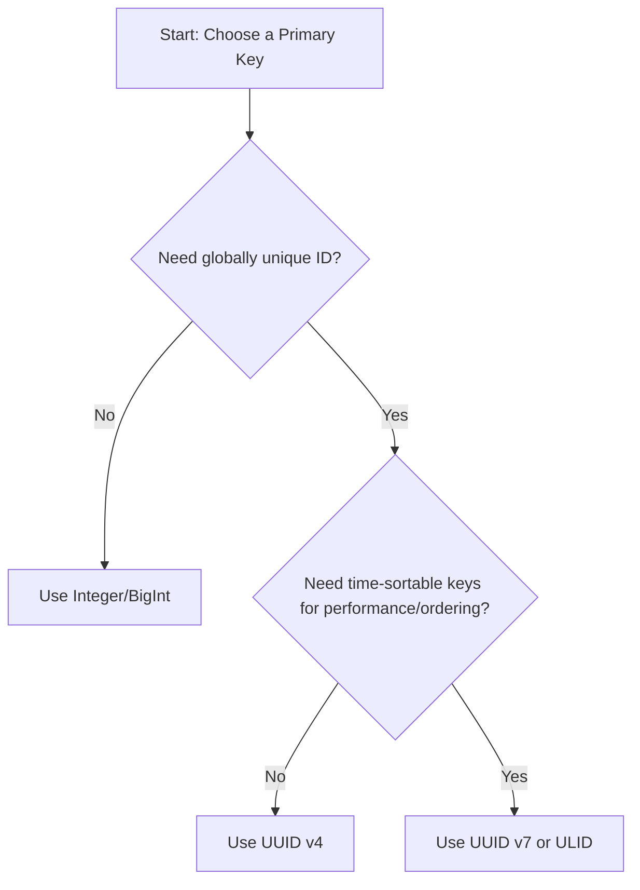

# SpringBoot_CQRS

## RoadMap
1. Requirement and Function Analysis
2. Scope Management
3. Design and Diagram
4. Development Practice and Planning
5. Development (Trial & Error with new technologies)
6. Documentation (new Topic Learned during Development and Feedback)

## Development Principle
- Follows Top-Down Software Development Approach: UI Design -> DB Design -> Module Design
- Git Best Practice with "[A successful Git branching model](https://nvie.com/posts/a-successful-git-branching-model/)"

---
## Run Process
```bash
#1 Prepare directory and clone from github
git clone --recurse-submodules -j2 https://github.com/Thee5176/SpringBoot_CQRS
cd SpringBoot_CQRS

#2 make migration, build process

##2.1 Command Unit: spin up postgres container and set up DB
docker compose up postgres -d --build
cd springboot_cqrs_command
chmod +x mvnw
./mvnw flyway:migrate
./mvnw clean package -DskipTests
cd ..

##2.2 Query Unit:
cd springboot_cqrs_query
chmod +x mvnw
./mvnw clean package -DskipTests
cd ..

#3 Start All Service
docker compose build --no-cache
docker compose up -d
```
---
## New Technology Used (Trial & Error)
- Git Flow, Git Pull Request, Git Issues and Git Submodule
    - manage local branch according to best practice branching strategy [GitFlow]
    - review change before merge branch with Git Pull Request [Git Pull Request](https://github.com/pulls?q=is%3Apr+author%3AThee5176+archived%3Afalse+repository%3Bspringboot*)
    - Manage aggregate project that separate each git history [Git Submodule](https://github.com/Thee5176/SpringBoot_CQRS/tree/main)
    - Reference: [Git実践入門](https://gihyo.jp/book/2014/978-4-7741-6366-6)

- Github Workflow
    - set up continuous integration for verify building process
    - [Command Unit Workflow](https://github.com/Thee5176/springboot_cqrs_command/actions/workflows/testrun.yaml)
    - [Query Unit Build Workflow](https://github.com/Thee5176/springboot_cqrs_query/actions/workflows/testrun.yaml)
    - [Deployment Workflow](https://github.com/Thee5176/SpringBoot_CQRS/actions/workflows/testrun.yaml)

- Sourcery.ai - Pull Request Review Service
    - AI-generated change review guideline
    - create code suggestion [Example PR Review Message](https://github.com/Thee5176/springboot_cqrs_command/pull/9#issuecomment-3092684740)
    - source: [Sourcery AI](https://sourcery.ai/)

- Flyway 
    - set up Flyway database migration service in [pom.xml](https://github.com/Thee5176/springboot_cqrs_command/blob/develop/pom.xml#L162)
    - manage database version [source/main/resources/db/migrations](https://github.com/Thee5176/springboot_cqrs_command/tree/develop/src/main/resources/db/migration)
    - source: [Spring Doc](https://docs.spring.io/spring-boot/how-to/data-initialization.html#howto.data-initialization.migration-tool.flyway)

- JOOQ
    - Top-Down Development process with JOOQ Codegen
        - Design the Database with dbml language [DB Design Document](https://dbdocs.io/theerapong5176/Springboot_CQRS?view=relationships)
        - Generate DDL script from [dbdiagram.io](https://dbdiagram.io/)
        - Setup JOOQ Codegen dependency with [pom.xml](https://github.com/Thee5176/springboot_cqrs_command/blob/develop/pom.xml#L175)
        - source: [JOOQ Document](https://www.jooq.org/doc/latest/manual/code-generation/codegen-execution/codegen-maven/)

- ModelMapper
    - set up ModelMapper in [pom.xml](https://github.com/Thee5176/springboot_cqrs_command/blob/develop/pom.xml#L78)
    - config custom DTO [ModelMapperConfig](https://github.com/Thee5176/springboot_cqrs_command/blob/develop/src/main/java/com/thee5176/ledger_command/Application/config/ModelMapperConfig.java)
    - source: [ModelMapper Document](https://modelmapper.org/getting-started/)
 
- Arrange-Action-Assert Testing Process:
    1. Arrange - Establish testing data
    2. Action - Run the Test subject
    3. Assert - Check the desired behaviour result from test subject
  
      
- Unit Test and Integration Test
  - **Unit test** - check real output of each internal code component with [JUnit](https://github.com/Thee5176/springboot_cqrs_command/blob/develop/src/test/java/com/thee5176/ledger_command/Application/dto/CreateLedgerDTOTest.java)
  - **Integration test** - check for integration call of other function and mock the output with [Mockito](https://github.com/Thee5176/springboot_cqrs_command/blob/develop/src/test/java/com/thee5176/ledger_command/Domain/service/LedgerCommandServiceTest.java)
  
- [Docker Merge Compose file](https://github.com/Thee5176/SpringBoot_CQRS/blob/main/compose.yaml)

---
## New Topic Learned (Meeting & Feedback)
- Microservice vs Monolith Architecture
    - **Comparison Table:**
        | Feature             | Monolith                                       | Microservice                                     |
        |---------------------|------------------------------------------------|--------------------------------------------------|
        | **Performance**     | Potentially faster due to direct in-process calls. | Slower due to network latency between services.  |
        | **Resource**        | Less overhead, single deployment unit.         | Higher overhead, each service needs its own resources. |
        | **Shared Development**| Tightly coupled, harder for large teams to work in parallel. | Loosely coupled, easier for teams to work independently. |
        | **Development Speed** | Initially faster, but slows down as the codebase grows. | Slower to start, but maintains speed as system scales. |

- Usage of UUID/ULID/Integer as DB primary key
    - **Comparison Table:**
        | key_type | bit_count | key_amount      | order     | randomness      |
        |----------|-----------|-----------------|-----------|-----------------|
        | UUID v7  | 128-bit   | ~3.4 x 10^38    | Yes       | High (74 bits)  |
        | UUID v4  | 128-bit   | ~3.4 x 10^38    | No        | High (122 bits) |
        | ULID     | 128-bit   | ~3.4 x 10^38    | Yes       | High (80 bits)  |
        | Integer  | 32-bit    | ~4.3 billion    | Yes       | None            |
    - **Situational Usage:**
        - **Integer/BigInt**: Best for simple, single-database applications where global uniqueness is not required. They are small, fast, and human-readable.
        - **UUID v4**: Use in distributed systems where keys must be globally unique but order is not important. The high randomness prevents guessability. Can cause DB index fragmentation.
        - **ULID/UUID v7**: Ideal for distributed systems requiring globally unique, time-sortable keys. This improves database insert performance by preventing index fragmentation. UUID v7 is the modern IETF standard.
    - **Decision Flowchart:**


- Ubitiquous Language and Entity Name Refactoring
    - Reserved word, Software development vocab
    - Tips: Master and Transaction Entity, Use Specific language

- Validation Chain
    - Frontend -> DTO validation -> ... -> Database validation
    - Validate the same logic in different layer might seems redundant but it help ensure the dataflow quality
    - Validate and throw data early on also help minimize the exception throw chain which improve throughput time and overall system load

- Master Data management approach
    - **Enum**
        - Pros: In-memory storage (faster to read versus making query to database), Ensure Concistency (Can't be change from user side)
        - Cons: Static Hardcoded Datastorage (changing requred developer to edit the souce code)

    - **Master Entity (Table)**
        - Pros: Dynamic Datastorage (make change on dataset can be done in user side)
        - Cons: Consistency Issue (data is manipulatable via query)

# Agile vs Waterfall Development Approach

## Comparison Table: Agile vs. Waterfall

| **Aspect**              | **Agile**                                                                 | **Waterfall**                                                            |
|-------------------------|---------------------------------------------------------------------------|--------------------------------------------------------------------------|
| **Team Structure**      | Flat, collaborative, everyone contributes ideas.                          | Hierarchical, with leaders assigning tasks based on skill level.         |
| **Planning Approach**   | Minimal upfront planning, evolves during sprints.                         | Extensive upfront planning with fixed phases.                            |
| **Workflow**            | Iterative and incremental (short sprints).                                | Sequential phases (requirements → design → implementation → testing).    |
| **Flexibility**         | Highly adaptable to changing requirements.                                | Rigid, changes are costly after planning is complete.                    |
| **Documentation**       | Lightweight, focuses on working software over documentation.              | Heavy documentation and design specifications required.                  |
| **Skill Dependency**    | Works best when team members have similar skill levels.                   | Works well with mixed skill levels under clear leadership.               |
| **Delivery**            | Delivers small, functional increments early and often.                    | Delivers a complete product at the end of the project lifecycle.         |
| **Testing**             | Continuous testing integrated into each sprint.                           | Testing occurs late, after implementation.                               |
| **Customer Feedback**   | Frequent, at the end of each sprint or iteration.                         | Limited feedback until final stages of the project.                      |
| **Best Suited For**     | Dynamic projects with evolving requirements.                              | Projects with well-defined and stable requirements.                      |

---

 ## Team Structure and Collaboration  
    
   ### **Agile**
   Agile development thrives in **flat organizational structures** where every team member is encouraged to actively contribute ideas. Each person works autonomously on their tasks, and collaboration happens through **short sprints** (periodic work intervals). At the end of each sprint, team members share progress, discuss feedback, and adapt their approaches for the next cycle.
  - **Advantages:**
      - Encourages creativity and innovation by allowing everyone to present ideas.
      - Rapid feedback loops enable continuous improvement.
      - Increases team ownership of the project.
   
  - **Challenges:**
  - **Skill disparity can reduce overall efficiency.** If team members have significant differences in technical expertise, frequent information sharing may slow down progress.
  - The time cost of regular meetings and sprint reviews can be high.
    
   ---
    
   ### **Waterfall**
   Waterfall development is well-suited for **hierarchical structures** where team members have varying technical skill levels. In this approach, experienced team leads or architects design the system upfront, assign tasks according to skill levels, and guide the less experienced members.
  
  - **Advantages:**
      - Clear leadership ensures structured decision-making.
      - Reduces confusion for team members with less technical knowledge.
      - Well-defined roles and responsibilities prevent duplication of work.
    
   - **Challenges:**
      - Limited opportunity for lower-level team members to contribute ideas early.
      - Can be inflexible when project requirements change mid-development.


---

## Project Lifecycle Management (PLCM)

### **Waterfall**
Waterfall requires **comprehensive upfront planning**. Every phase — requirements gathering, system design, implementation, testing, and deployment — is completed sequentially. Documentation and design are created early and often follow  **V-Model**:
- **V-Model Overview:** Each development stage (on the left side of the "V") has a corresponding testing stage (on the right side). For example, requirements are validated by acceptance tests, design by system tests, and so forth.

**Pros:**
- Predictable timelines and deliverables.
- Clear documentation ensures traceability.
- Ideal for projects with fixed requirements and minimal expected changes.

**Cons:**
- Inflexible to changing requirements.
- Late testing phases can lead to delayed discovery of critical issues.
- Requires significant time investment before coding even begins.

---

### **Agile**
Agile PLCM is **iterative and incremental**. Rather than planning every detail upfront, the project evolves through **sprints** (typically 1–4 weeks). At the end of each sprint, a potentially shippable product increment is delivered, and feedback is integrated before the next sprint.

**Common Agile Practices:**
- **Scrum:** Defined roles (Product Owner, Scrum Master, Development Team) with regular sprint reviews and retrospectives.
- **Kanban:** Visual boards for managing and limiting work in progress (WIP).
- **Continuous Integration/Continuous Delivery (CI/CD):** Frequent integration and automated deployment pipelines.

**Pros:**
- Adapts quickly to changing requirements.
- Delivers value early through incremental releases.
- Encourages collaboration and customer involvement.

**Cons:**
- Lack of upfront documentation can create long-term maintenance challenges.
- Requires a high degree of discipline and communication.
- May struggle with projects requiring strict compliance or fixed budgets.

---
