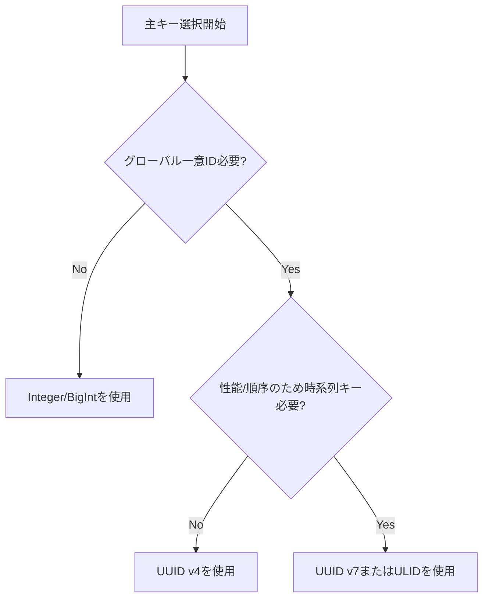

# SpringBoot_CQRS

// Table of Contents

## ロードマップ
1. 要件と機能分析
2. スコープ管理
3. 設計と図解
4. 開発プラクティスと計画
5. 開発（新技術による試行錯誤）
6. ドキュメント作成（開発中に学んだ新しいトピックとフィードバック）

## 開発原則
- トップダウン型ソフトウェア開発アプローチ：UI設計 → DB設計 → モジュール設計
- Gitベストプラクティス「[成功するGitブランチモデル](https://nvie.com/posts/a-successful-git-branching-model/)」

---
## 実行手順
```bash
#1 ディレクトリ準備とGitHubからクローン
mkdir ledger_cqrs_unit
cd ledger_cqrs_unit
git clone https://github.com/Thee5176/springboot_cqrs_command springboot_cqrs_command
git clone https://github.com/Thee5176/springboot_cqrs_query springboot_cqrs_query

#2 マイグレーション・ビルドプロセス

##2.1 コマンドユニット：Postgresコンテナ起動とDBセットアップ
docker compose up postgres -d --build
cd springboot_cqrs_command
chmod +x mvnw
./mvnw flyway:migrate
./mvnw clean package -DskipTests
cd ..

##2.2 クエリユニット：
cd springboot_cqrs_query
chmod +x mvnw
./mvnw clean package -DskipTests
cd ..

#3 全サービス起動
docker compose build --no-cache
docker compose up -d
```
---
## 新技術の導入（試行錯誤）
- Git Flow, Git Pull Request, Git Issues, Git Submodule
    - ベストプラクティスに従ったローカルブランチ管理 [GitFlow]
    - マージ前の変更レビュー [Git Pull Request](https://github.com/pulls?q=is%3Apr+author%3AThee5176+archived%3Afalse+repository%3Bspringboot*)
    - 個別履歴管理のための集約プロジェクト [Git Submodule](https://github.com/Thee5176/SpringBoot_CQRS/tree/main)
    - 参考: [Git実践入門](https://gihyo.jp/book/2014/978-4-7741-6366-6)

- Github Workflow
    - 継続的インテグレーションによるビルド検証
    - [コマンドユニットワークフロー](https://github.com/Thee5176/springboot_cqrs_command/actions/workflows/testrun.yaml)
    - [クエリユニットビルドワークフロー](https://github.com/Thee5176/springboot_cqrs_query/actions/workflows/testrun.yaml)
    - [デプロイメントワークフロー](https://github.com/Thee5176/SpringBoot_CQRS/actions/workflows/testrun.yaml)

- Sourcery.ai - プルリクエストレビューサービス
    - AIによる変更レビューガイドライン
    - コード提案作成例 [PRレビュー例](https://github.com/Thee5176/springboot_cqrs_command/pull/9#issuecomment-3092684740)
    - 参考: [Sourcery AI](https://sourcery.ai/)

- Flyway 
    - [pom.xml](https://github.com/Thee5176/springboot_cqrs_command/blob/develop/pom.xml#L162)でFlyway DBマイグレーションサービス設定
    - DBバージョン管理 [source/main/resources/db/migrations](https://github.com/Thee5176/springboot_cqrs_command/tree/develop/src/main/resources/db/migration)
    - 参考: [Spring Doc](https://docs.spring.io/spring-boot/how-to/data-initialization.html#howto.data-initialization.migration-tool.flyway)

- JOOQ
    - JOOQ Codegenによるトップダウン開発
        - dbml言語でDB設計 [DB設計ドキュメント](https://dbdocs.io/theerapong5176/Springboot_CQRS?view=relationships)
        - [dbdiagram.io](https://dbdiagram.io/)でDDLスクリプト生成
        - JOOQ Codegen依存関係設定 [pom.xml](https://github.com/Thee5176/springboot_cqrs_command/blob/develop/pom.xml#L175)
        - 参考: [JOOQ Document](https://www.jooq.org/doc/latest/manual/code-generation/codegen-execution/codegen-maven/)

- ModelMapper
    - [pom.xml](https://github.com/Thee5176/springboot_cqrs_command/blob/develop/pom.xml#L78)でModelMapper設定
    - カスタムDTO設定 [ModelMapperConfig](https://github.com/Thee5176/springboot_cqrs_command/blob/develop/src/main/java/com/thee5176/ledger_command/Application/config/ModelMapperConfig.java)
    - 参考: [ModelMapper Document](https://modelmapper.org/getting-started/)
 
- Arrange-Action-Assert テストプロセス:
    1. Arrange - テストデータ準備
    2. Action - テスト対象実行
    3. Assert - 期待動作の検証
  
    
- ユニットテストと統合テスト
  - **ユニットテスト** - 各内部コードコンポーネントの出力検証 [JUnit](https://github.com/Thee5176/springboot_cqrs_command/blob/develop/src/test/java/com/thee5176/ledger_command/Application/dto/LedgersEntryTest.java)
  - **統合テスト** - 他関数の統合呼び出しと出力モック [Mockito](https://github.com/Thee5176/springboot_cqrs_command/blob/develop/src/test/java/com/thee5176/ledger_command/Domain/service/LedgerCommandServiceTest.java)
  
- [Docker マージComposeファイル](https://github.com/Thee5176/SpringBoot_CQRS/blob/main/compose.yaml)

---
## 新しく学んだトピック（会議・フィードバック）
- マイクロサービス vs モノリスアーキテクチャ
    - **比較表：**
        | 特徴               | モノリス                                       | マイクロサービス                                     |
        |---------------------|------------------------------------------------|--------------------------------------------------|
        | **パフォーマンス**     | プロセス内直接呼び出しで高速な場合がある。         | サービス間のネットワーク遅延で低速。                |
        | **リソース**        | オーバーヘッド少、単一デプロイメントユニット。     | オーバーヘッド多、各サービスが独立したリソース必要。 |
        | **共同開発**        | 密結合で大規模チームの並行作業が困難。             | 疎結合で独立したチーム作業が容易。                  |
        | **開発速度**        | 初期は速いがコードベース拡大で遅くなる。           | 初期は遅いがシステム拡張で速度維持。                |

- UUID/ULID/IntegerのDB主キー利用
    - **比較表：**
        | key_type | bit数    | キー数            | 順序     | ランダム性        |
        |----------|-----------|-------------------|-----------|-------------------|
        | UUID v7  | 128-bit   | ~3.4 x 10^38      | あり      | 高（74ビット）    |
        | UUID v4  | 128-bit   | ~3.4 x 10^38      | なし      | 高（122ビット）   |
        | ULID     | 128-bit   | ~3.4 x 10^38      | あり      | 高（80ビット）    |
        | Integer  | 32-bit    | ~43億             | あり      | なし              |
    - **状況別利用：**
        - **Integer/BigInt**: 単純な単一DBアプリ向け。グローバル一意性不要。小さく高速で人間可読。
        - **UUID v4**: 分散システムで一意性必要だが順序不要。高ランダム性で推測困難。DBインデックス断片化の可能性。
        - **ULID/UUID v7**: 一意性と時系列順序が必要な分散システム向け。インデックス断片化防止で挿入性能向上。UUID v7は最新標準。
    - **決定フローチャート：**


- ユビキタス言語とエンティティ名リファクタリング
    - 予約語、開発用語
    - コツ：マスター・トランザクションエンティティ、具体的な言語使用

- バリデーションチェーン
    - フロントエンド → DTOバリデーション → ... → DBバリデーション
    - 各層で同じロジックを検証するのは冗長に見えるが、データフロー品質向上に有効
    - 早期バリデーションで例外発生を最小化し、スループットとシステム負荷を改善

- マスターデータ管理アプローチ
    - **Enum**
        - 長所：インメモリ保存（DBクエリより高速）、一貫性保証（ユーザー側で変更不可）
        - 短所：静的ハードコード（変更はソース編集必要）

    - **マスターエンティティ（テーブル）**
        - 長所：動的データ保存（ユーザー側で変更可能）
        - 短所：一貫性問題（クエリでデータ操作可能）

# アジャイル vs ウォーターフォール開発手法

## 比較表: アジャイル vs. ウォーターフォール

| **項目**              | **アジャイル**                                                                 | **ウォーターフォール**                                                            |
|-------------------------|---------------------------------------------------------------------------|--------------------------------------------------------------------------|
| **チーム構成**      | フラットで協力的、全員がアイデアを出す。                          | 階層型、リーダーがスキルに応じてタスク割り当て。         |
| **計画手法**   | 最小限の事前計画、スプリント中に進化。                         | 事前計画が多く、固定フェーズ。                            |
| **ワークフロー**            | イテレーティブかつインクリメンタル（短いスプリント）。                                | 順次フェーズ（要件→設計→実装→テスト）。    |
| **柔軟性**         | 要件変更に高い適応性。                                | 固定的、計画後の変更は高コスト。                    |
| **ドキュメント**       | 軽量、動作するソフト重視。              | 重厚なドキュメントと設計仕様が必要。                  |
| **スキル依存**    | メンバーのスキルが均等な場合に最適。                   | 明確なリーダーシップで混在スキルに対応。               |
| **納品**            | 小さな機能単位を早期・頻繁に納品。                    | プロジェクト終了時に全体納品。         |
| **テスト**             | 各スプリントで継続的テスト。                           | 実装後にテスト。                               |
| **顧客フィードバック**   | 各スプリント・イテレーション終了時に頻繁。                         | 最終段階まで限定的。                      |
| **適合プロジェクト**     | 要件が変化する動的プロジェクト。                              | 要件が明確で安定したプロジェクト。                      |

---

 ## チーム構成とコラボレーション  
    
 ### **アジャイル**
    アジャイル開発は**フラットな組織構造**で、全員が積極的にアイデアを出すことを推奨します。各自が自律的にタスクを進め、**短いスプリント**（定期的な作業期間）で協力します。スプリント終了時に進捗共有・フィードバック・次サイクルへの適応を行います。
 - **利点：**
      - 全員がアイデアを出しやすく、創造性・革新性が高まる。
      - 迅速なフィードバックで継続的改善。
      - チームのプロジェクト所有感向上。
   
  - **課題：**
  - **スキル差が大きいと効率低下。** 技術力に差があると情報共有頻度が高まり進捗が遅れる場合がある。
  - 定期的な会議・レビューの時間コストが高い。
    
   ---
    
   ### **ウォーターフォール**
   ウォーターフォール開発は**階層型構造**で、技術力に差がある場合に適しています。経験豊富なリーダーやアーキテクトが設計を行い、スキルに応じてタスクを割り当て、指導します。
   
   - **利点：**
      - 明確なリーダーシップで意思決定が構造化。
      - 技術力が低いメンバーの混乱を防止。
      - 役割・責任が明確で作業重複を防ぐ。
    
   - **課題：**
      - 下位メンバーが初期段階でアイデアを出す機会が少ない。
      - 開発途中で要件変更があると柔軟性に欠ける。

---

## プロジェクトライフサイクル管理（PLCM）

### **ウォーターフォール**
ウォーターフォールは**事前計画が徹底**されています。要件定義、設計、実装、テスト、デプロイメントの各フェーズを順次実施。ドキュメント・設計は初期に作成され、**Vモデル**に従うことが多い：
- **Vモデル概要：** 開発各段階（Vの左側）に対応するテスト段階（右側）がある。例：要件は受入テスト、設計はシステムテストで検証。

**長所：**
- 予測可能な納期・成果物。
- 明確なドキュメントでトレーサビリティ確保。
- 要件が固定されたプロジェクトに最適。

**短所：**
- 要件変更に不向き。
- テストが後半になるため重大な問題発見が遅れる。
- コーディング前の計画に多くの時間が必要。

---

### **アジャイル**
アジャイルPLCMは**イテレーティブかつインクリメンタル**です。すべてを事前計画せず、**スプリント**（通常1～4週間）で進化。各スプリント終了時に出荷可能な成果物を納品し、フィードバックを次サイクルに反映。

**代表的なアジャイルプラクティス：**
- **スクラム：** 定義された役割（プロダクトオーナー、スクラムマスター、開発チーム）と定期的なスプリントレビュー・振り返り。
- **カンバン：** WIP（作業中）制限付きの可視化ボード。
- **CI/CD：** 頻繁な統合と自動デプロイ。

**長所：**
- 要件変更に迅速対応。
- インクリメンタルリリースで早期価値提供。
- コラボレーションと顧客参加を促進。

**短所：**
- 事前ドキュメント不足で長期保守に課題。
- 高い規律とコミュニケーションが必要。
- 厳格なコンプライアンスや固定予算プロジェクトには不向き。

---
